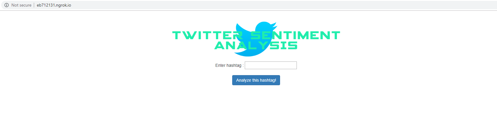
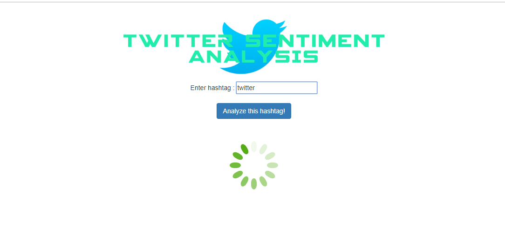
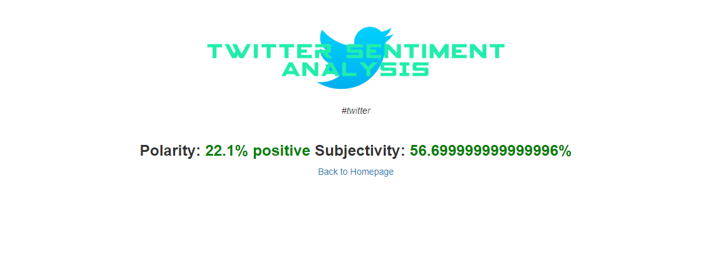

# Twitter Sentiment Analysis


```Twitter``` is a microblogging and social networking service on which users post and interact with messages known as "tweets". Twitter is a platform where you can easily share news from everywhere, making it an efficient medium for communication.

```Sentiment analysis``` refers to the use of natural language processing, text analysis, computational linguistics, and biometrics to systematically identify, extract, quantify, and study affective states and subjective information. There are 2 characteristics which define a sentiment; ```polarity``` and ```subjectivity```.

```polarity``` is a float which lies in the range of [-1,1] where 1 means positive statement and -1 means a negative statement. 

```subjectivity```generally refers to personal opinion, emotion or judgment whereas objectivity refers to factual information. Subjectivity is also a float which lies in the range of [0,1].

This project makes use of ```TextBlob```; a python library used for Natural Language Processing, ```tweepy```; a python library used for accessing the Twitter API, and ```flask``` for deploying it as a web-application. It involves obtaining random tweets from users across the world based on the hashtag entered, analyzing these tweets and calculating the mean polarity and subjectivity from these texts. 
The hashtags that are searched  are also stored on the server in a text file with it's polarity and subjectivity. 


## Usage

1. Install all the necessary packages required, which are:

* textblob
* tweepy
* flask
* numpy

You can use the following pip command to download and install these libraries:

    pip install textblob tweepy flask numpy

2. Clone or download the repository and extract it into a folder and open it.

3. The ```tweepy``` library  requires a functioning twitter developer account and an application on developer.twitter.com in order to generate ```consumer key```, ```consumer key secret```, ```access token``` and ```access token secret```. These values are used by tweepy to make twitter API request calls in order to receive the tweets that are analyzed. 
Refer https://docs.inboundnow.com/guide/create-twitter-application/ to understand how a twitter application can be made. 

   After you have successfully made an application, generate the 4 variables on the developer.twitter.com website and change the following code in ```app.py``` file:

    ```
   consumer_key = 'your consumer key'
    consumer_secret = 'your consumer secret key'
    access_token = 'your access token'
    access_token_secret = 'your access token secret' 


3. ```cd``` into the directory and set the flask environment variable to the application name (app.py by default): 

    ```set FLASK_APP=app.py ``` (for Windows)

    ```export FLASK_APP=app.py ``` (for macOS/Linux)

4. After the environment variable has been set, you can run the application using the following command:

    ``` flask run ```

5. Open the localhost address (127.0.0.1:5000) and use the application to analyze any hashtag.


## Output
Homepage:


Processing: (performing API calls and analyzing the received tweets)


Results: (In terms of polarity and subjectivity)

